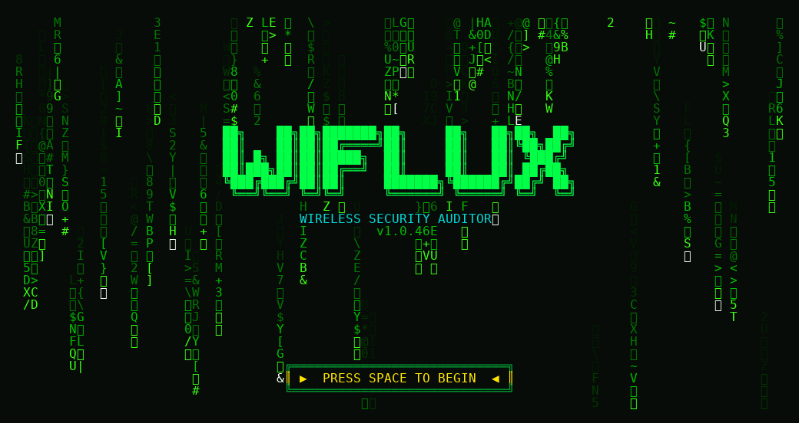

# Wiflux

**Modern wireless security auditor** with a live terminal UI, smart attack orchestration, and built-in dependency management.

```
██╗    ██╗██╗███████╗██╗     ██╗   ██╗██╗  ██╗
██║    ██║██║██╔════╝██║     ██║   ██║╚██╗██╔╝
██║ █╗ ██║██║█████╗  ██║     ██║   ██║ ╚███╔╝
██║███╗██║██║██╔══╝  ██║     ██║   ██║ ██╔██╗
╚███╔███╔╝██║██║     ███████╗╚██████╔╝██╔╝ ██╗
 ╚══╝╚══╝ ╚═╝╚═╝     ╚══════╝ ╚═════╝ ╚═╝  ╚═╝
```

> **For authorized security testing only.** Only use Wiflux on networks you own or have explicit permission to audit.

[](https://www.python.org/downloads/)
[](LICENSE)
[](https://github.com/Leadrogue/Wiflux/releases/latest)



---

## Features

- **Live Rich UI** — Real-time scan table with signal, encryption, WPS status, clients, and priority scoring
- **Matrix welcome screen** — Optional splash with dependency check (`--no-splash` to skip)
- **ESSID-smart wordlist** — Targeted candidates from network name + vendor before rockyou (preview, up to 100k)
- **Crack ladder** — ESSID-smart → vendor defaults → full dictionary → hashcat rules (fastest-to-longest); Space skips a pass (`--no-crack-ladder`)
- **Adaptive deauth** — Handshake capture tunes burst/listen timing from live capture health (`--no-adaptive-deauth`)
- **Multi-backend deauth** — mdk4, aireplay-ng, bettercap, mdk3 (`--deauth-tools`, `--deauth-combo`)
- **PMKID enhancements** — Passive-first capture, dual-band rotation, success screen before cracking
- **WPS enhancements** — Algorithmic PIN pre-pass, offline pixiewps from scan caps
- **WPA2/WPA3 transition** — Prefer WPA2 capture/crack on mixed-mode APs (`--no-transition-downgrade`)
- **6 GHz scanning** — `--6ghz` for Wi-Fi 6E (adapter-dependent)
- **Client band-stalk** — Post-deauth listen on sibling bands for roaming stations
- **Handshake validation** — Full capture check with on-screen confirm before hashcat
- **Hidden SSID decloak** — Deauth probe to reveal cloaked ESSIDs during scan
- **SQLite results store** — Track cracked networks; skip by default (`--no-ignore-cracked` to re-attack)
- **92 automated tests** — No live radio required for CI

### Supported attacks

| Attack | Tools | Notes |
|--------|-------|-------|
| WEP | `aireplay-ng`, `aircrack-ng` | ARP replay with configurable timeout |
| WPS Pixie-Dust | `reaver` / `bully`, `pixiewps` | Offline pixie from scan caps when available |
| WPS PIN | `reaver` / `bully` | Algorithmic MAC/vendor PINs first |
| PMKID | `hcxdumptool`, `hcxpcapngtool` | Clientless; passive ratio + band rotation |
| WPA handshake | Multi deauth backends, `hashcat` | Adaptive timing, band-stalk, validation UI |

---

## Quick start

### Install from release (recommended)

Download **[v1.0.4](https://github.com/Leadrogue/Wiflux/releases/tag/v1.0.4)**:

```bash
curl -LO https://github.com/Leadrogue/Wiflux/releases/download/v1.0.4/wiflux-1.0.4-linux-installer.tar.gz
tar -xzf wiflux-1.0.4-linux-installer.tar.gz
cd wiflux-1.0.4-linux-installer
./install.sh
```

Or install directly with pip:

```bash
pip install https://github.com/Leadrogue/Wiflux/releases/download/v1.0.4/wiflux-1.0.4-py3-none-any.whl --break-system-packages
```

### Install from source

```bash
git clone https://github.com/Leadrogue/Wiflux.git
cd Wiflux
pip install -e . --break-system-packages
```

### Run

On Kali/Debian, `sudo` may not include `/usr/local/bin` in `PATH`:

```bash
sudo env PATH="/usr/local/bin:$PATH" wiflux --kill --restore   # Interactive audit
sudo env PATH="/usr/local/bin:$PATH" wiflux --auto -p 30       # Auto-attack after 30s scan
```

See [INSTALL.md](INSTALL.md), [docs/RELEASE.md](docs/RELEASE.md), and [docs/TUTORIAL.md](docs/TUTORIAL.md).

---

## Documentation

| Document | Description |
|----------|-------------|
| [INSTALL.md](INSTALL.md) | Requirements, adapter setup, wordlists, troubleshooting |
| [CHANGELOG.md](CHANGELOG.md) | Version history and release notes |
| [docs/RELEASE.md](docs/RELEASE.md) | Download and verify release artifacts |
| [docs/TUTORIAL.md](docs/TUTORIAL.md) | Step-by-step walkthrough |
| [CONTRIBUTING.md](CONTRIBUTING.md) | Development setup and tests |

---

## Usage examples

```bash
wiflux --help                    # Grouped, colorized CLI reference

# 5 GHz + auto-attack
sudo wiflux --5ghz --auto -p 45

# 6 GHz scan (Wi-Fi 6E adapter required)
sudo wiflux --6ghz --auto -c 37,53

# Target one network; re-attack even if already cracked
sudo wiflux --no-ignore-cracked -b AA:BB:CC:DD:EE:FF

# Fresh handshake; ignore saved caps in hs/
sudo wiflux --new-hs -b AA:BB:CC:DD:EE:FF

# PMKID only
sudo wiflux --pmkid --auto -p 60

# Capture only
sudo wiflux --skip-crack --auto -p 30

# Utilities (no sudo)
wiflux --cracked
wiflux --check capture.cap
wiflux --export results.json
```

### Key options (v1.0.4)

| Flag | Description |
|------|-------------|
| `-i INTERFACE` | Wireless interface (e.g. `wlan0mon`) |
| `--kill` / `--restore` | Kill interfering processes / restore managed mode |
| `-p SECONDS` | Auto-attack after N seconds of scanning |
| `--auto` | Non-interactive mode |
| `-5` / `--5ghz` | Include 5 GHz channels |
| `--6ghz` | Include 6 GHz (Wi-Fi 6E) |
| `--no-ignore-cracked` | Show networks already in crack database |
| `--new-hs` | Ignore saved handshakes; force live capture |
| `--no-transition-downgrade` | Do not prefer WPA2 on WPA2+WPA3 APs |
| `--no-crack-ladder` | Skip vendor/rules stages before full dictionary |
| `--no-algorithmic-wps` | Skip MAC/vendor WPS PIN pre-pass |
| `--no-offline-pixie` | Skip offline pixiewps from scan caps |
| `--no-client-band-stalk` | Disable post-deauth band-hop listen |
| `--no-pmkid-band-rotate` | Disable PMKID dual-band rotation |
| `--pmkid-passive-ratio` | PMKID passive capture fraction (0.2–0.75) |
| `--deauth-burst` / `--deauth-listen` | Baseline deauth packets / listen window (default 5 / 8) |
| `--deauth-tools` | Comma-separated deauth backends |
| `--dict FILE` | Custom wordlist |
| `--no-splash` | Skip Matrix welcome screen |

---

## Development

```bash
cd Wiflux
pip install -e ".[dev]" --break-system-packages
python -m pytest tests/test_wiflux.py -q
```

---

## Requirements

- Linux (Kali, Parrot, etc.)
- Python 3.10+
- Wi-Fi adapter with monitor mode + injection
- [aircrack-ng](https://www.aircrack-ng.org/) (required)
- [reaver](https://github.com/t6x/reaver-wps-fork-t6x), [hcxdumptool](https://github.com/ZerBea/hcxdumptool), [hashcat](https://hashcat.net/hashcat/), [pixiewps](https://github.com/wiire-a/pixiewps), [tshark](https://www.wireshark.org/) (optional, recommended)

---

## Legal disclaimer

This tool is provided for educational and authorized penetration testing purposes only. Unauthorized access to computer networks is illegal. The authors and contributors are not responsible for misuse of this software.

---

## License

[MIT License](LICENSE) — Copyright (c) 2026 Wiflux Contributors